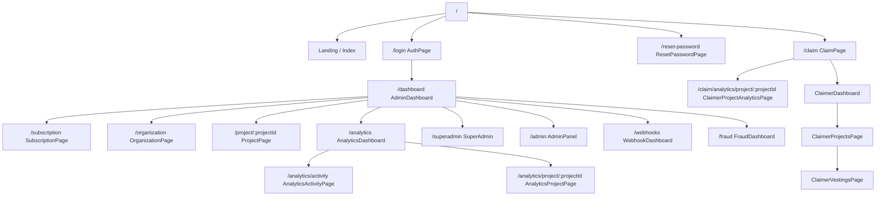
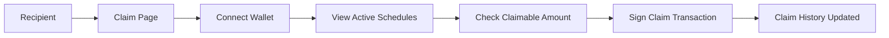
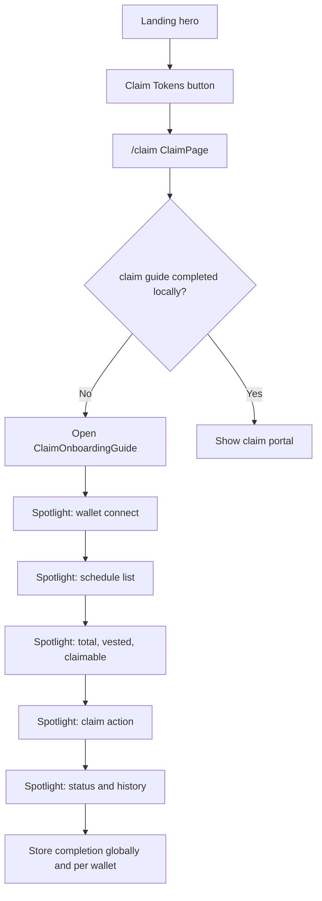
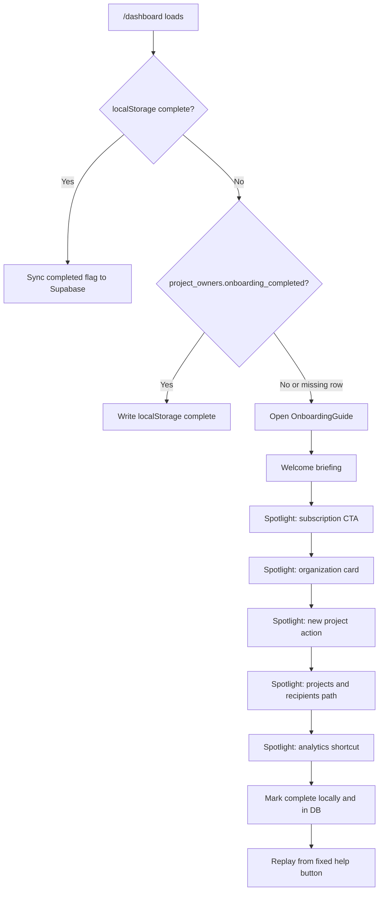
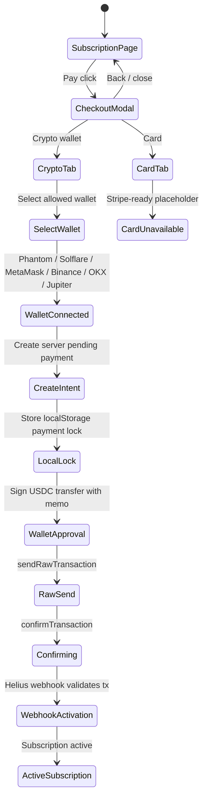
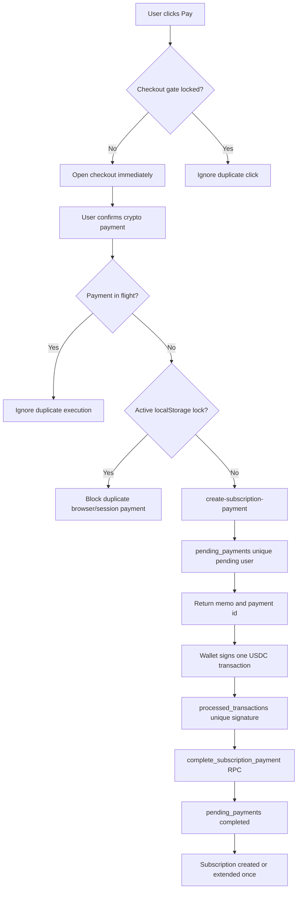
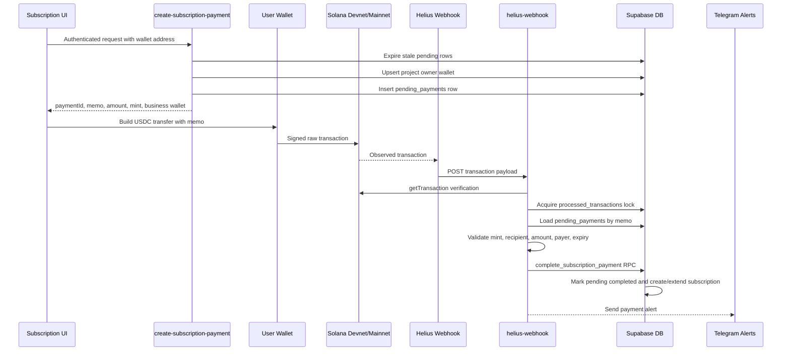
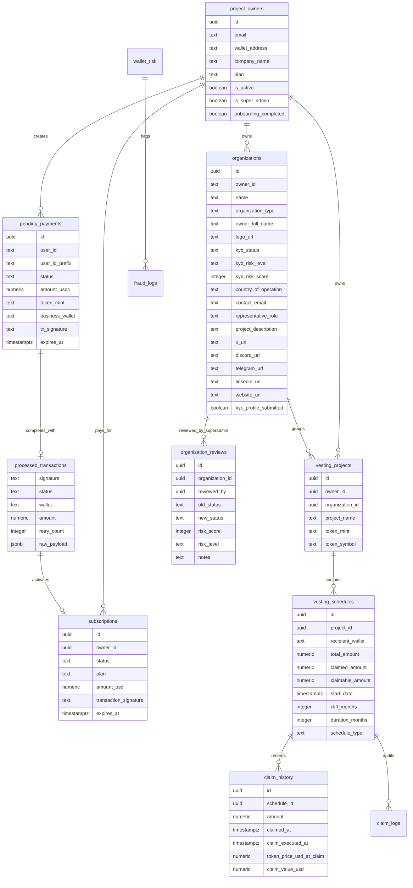
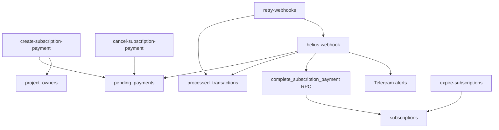

# VestingApp Design Map

Editable design map for the current product, UI routes, subscription payment system, backend automation, and core data model.

## Product Shape

VestingApp has three main product tracks:

- Marketing and authentication: landing page, login, password reset.
- Issuer/admin workspace: dashboard, organizations, projects, schedules, analytics, subscription, fraud/webhook monitoring.
- Recipient/claimer workspace: wallet-based claim portal for viewing and claiming vested tokens.

## Route Map

## Primary User Flows

```mermaid
flowchart LR
  Visitor["Visitor"] --> Landing["Landing Page"]
  Landing --> Login["Login / Sign Up"]
  Login --> Dashboard["Issuer Dashboard"]
  Dashboard --> Subscribe["Subscription Checkout"]
  Subscribe --> Active["Active Subscription"]
  Active --> CreateOrg["Create Organization + KYC"]
  CreateOrg --> CreateProject["Create Project"]
  CreateProject --> CreateSchedule["Create Vesting Schedule"]
  CreateSchedule --> Recipient["Recipient Claims Tokens"]
```

## Claim Portal Onboarding

The landing page now gives recipients a direct `Claim Tokens` action into `/claim`. The claim route has its own localStorage-first guide because recipients may not have a `project_owners` row.

## Gamified Dashboard Onboarding

The dashboard carries the first-run quest. It uses a localStorage-first check for instant UX, then syncs the `project_owners.onboarding_completed` flag when a database owner row exists.

## Subscription Checkout

The checkout is subscription-first: the plan remains the center of the page, and the modal only asks how the user wants to pay for the Starter subscription.

## Duplicate Payment Protection

## Backend Payment Flow

## Main UI Surfaces

| Area | File | Purpose |
| --- | --- | --- |
| Landing | `src/pages/Index.tsx`, `src/LandingPage.tsx`, `src/components/landing/*` | Public marketing surface |
| Auth | `src/AuthPage.tsx`, `src/ResetPasswordPage.tsx` | Login and account recovery |
| Dashboard | `src/AdminDashboard.tsx`, `src/components/onboarding/OnboardingGuide.tsx` | Main issuer/admin workspace with replayable quest onboarding |
| Organization KYC | `src/OrganizationPage.tsx`, `src/CreateOrganization.tsx` | Subscription-gated owner wallet, organization identity, and official links form |
| Project detail | `src/ProjectPage.tsx` | Project schedules and management |
| Subscription | `src/SubscriptionPage.tsx`, `src/components/subscription/*`, `src/payments/*` | Starter plan, checkout modal, wallet payment orchestration |
| Claim portal | `src/App.tsx`, `src/ClaimerProjectAnalyticsPage.tsx`, `src/components/onboarding/ClaimOnboardingGuide.tsx`, `src/ClaimerDashboard.tsx`, `src/ClaimerProjectsPage.tsx`, `src/ClaimerVestingsPage.tsx` | Recipient token claim flow, organization/project analytics selector, and replayable local guide |
| Admin tools | `src/AdminPanel.tsx`, `src/SuperAdmin.tsx` | Elevated admin functions |
| Monitoring | `src/AnalyticsDashboard.tsx`, `src/AnalyticsActivityPage.tsx`, `src/AnalyticsProjectPage.tsx`, `src/WebhookDashboard.tsx`, `src/FraudDashboard.tsx` | Analytics, per-project analytics pages, full backend activity explorer-lite view, webhooks, risk signals |

## Core Data Model

## Supabase Edge Functions

## Theme Modes

- `Purple Mode`: default violet and green VestingApp identity.
- `Green Mode`: green-first Solana operational mode.
- `Crimson Mode`: dark red and hot pink Solana glow mode.
- `Solar Mode`: electric yellow and chartreuse Solana glow mode with sparse yellow-green and yellow-white twinkling star dust.
- `Prism Mode`: neon purple, magenta, and orange multi-glow mode.
- The top `ThemeToggle` button cycles through all modes using the same `va-theme` localStorage and `data-theme` CSS-variable mechanism.

## Design Notes

- Keep issuer/admin screens dense, scannable, and operational.
- Keep organization creation subscription-gated and trust-profile focused: DAO profiles require X, Discord, and Telegram; company profiles require LinkedIn, website, and Meta/Facebook or Instagram. Superadmins may preview the form read-only on `/organization` without wallet, subscription, edits, or submission. Organization `logo_url` is optional and feeds project analytics circular logos for linked projects. Every organization URL box is backed by database validation through `private.is_valid_public_url` and the `organizations_validate_url_fields` trigger, so plain text or malformed URLs cannot be saved if the frontend is bypassed.
- Keep KYB as a lightweight trust profile during paid beta: deterministic risk scoring plus superadmin review controls only public trust badges, not project creation.
- Keep subscription UI plan-centered, not deposit-centered.
- Keep the claim flow wallet-first and minimal.
- Treat card payments as a separate processor-backed subscription checkout, not a fake local action.
- Treat frontend locks as UX protection only; `pending_payments` and `processed_transactions` are the durable duplicate guards.
- Keep the memo format stable: `vestingapp-starter-${userIdPrefix}`.
- Keep the dashboard onboarding replayable, dismissible, and anchored to real controls, including the visible analytics shortcut, instead of explanatory pages.
- Keep live backend activity readable: `/analytics` shows a short recent preview, while `/analytics/activity` loads processed transactions with status filters, search, 20-row pagination, and 15-character signature previews.
- Keep project analytics separated by project: `/analytics` exposes circular project identity buttons using organization logo images when available, and `/analytics/project/:projectId` owns expanded claim, recipient, and schedule graphs. Admin progress uses a pie chart for claimed, claimable, and locked/unvested allocation state.
- Keep claimer analytics personal and wallet-scoped: `/claim` lets claimers choose organizations, then active projects they participate in; `/claim/analytics/project/:projectId` shows personal claiming progress, claim execution history, and stored claim-time USD value snapshots.
- Keep the claim portal reachable from the landing page and teach it separately from issuer onboarding.

## Mainnet Readiness

- Solana network selection defaults to `mainnet-beta`; `devnet` is only used when explicitly set for testing.
- Subscription crypto amount is network-locked: `99 USDC` on `mainnet-beta`, `0.1 USDC` on `devnet`.
- Helius webhook JWT verification is disabled at the Supabase gateway and protected by `HELIUS_WEBHOOK_SECRET`.
- Claiming is intentionally disabled by source-level readiness gates until the secure on-chain claim path is implemented.

## Open Design Decisions

- Choose the final card processor configuration for the Stripe-ready placeholder.
- Decide whether MetaMask/Binance/OKX/Jupiter support needs WalletConnect in addition to Solana Wallet Standard discovery.
- Decide whether `SuperAdmin`, `WebhookDashboard`, and `FraudDashboard` stay first-level routes or move behind a unified admin tools area.
